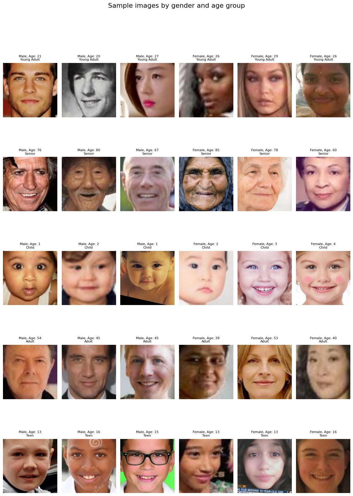
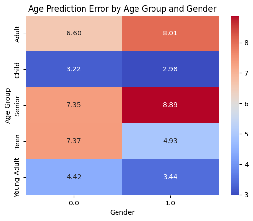
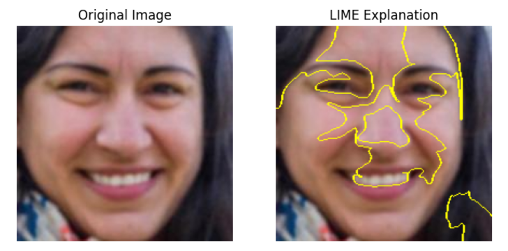

# Age and gender prediction using MobileNetV2

This project aims to predict gender and age from facial images using multitask learning. The UTKFace dataset is used and various deep learning techniques are applied including backbone exploration, hyperparameter tuning and loss scaling to improve model performance.

---

## Project overview

This project explores multitask learning for predicting:
1. **Gender classification**: Binary classification of male or female.
2. **Age regression**: Predicting the age of an individual in the image.

---


### Images preview


---

## Dataset description

- **Source**: [UTKFace Dataset](https://www.kaggle.com/datasets/jangedoo/utkface-new)
- **Metadata**: Images labeled with age, gender and race information.
- **Main preprocessing**:
  - Images are padded to 224x224 to match MobileNetV2 requirements.
  - Age is standartized.
  - Stratified splits according to gender, age group and race ensures balanced distribution across sets.

---

## Model Architecture

- **Backbone**: MobileNetV2
- **Gender prediction**:
  - **Loss**: Binary crossentropy
  - **Activation**: Sigmoid function
- **Age Prediction**:
  - **Loss**: Mean squared error (MSE)
  - **Activation**: Linear


## Results

| **Model Configuration**                                          | **Weighted Avg Accuracy** | **Weighted Avg F1 Score** | **Age MAE** | **Age RMSE** | **Description**                                                                                  |
|-------------------------------------------------------------------|---------------------------|---------------------------|-------------|--------------|----------------------------------------------------------------------------------------------|
| **Baseline MobileNETV2 Model**                                               | 82%                       | 82%                       | 9.58         | 12.37          | Only the output layer was trained, the rest of the model frozen. |
| **MobileNETV2 Model without sample weights**                                 | 90%                       | 90%                       | 6.61        | 8.69         | All layers of the model were trained using hyperparameters from the optuna trial.       |
| **MobileNETV2 Model with sample weights**                                    | 92%                       | 92%                       | 5.91        | 8.14         | Sample weights were introduced for gender.  |
| **MobileNETV2 Model with sample weights and image augmentation**             | 93%                       | 93%                       | 5.51        | 7.76         | Added image augmentations.    |
| **MobileNETV2 Model with sample weights, augmentation, and LR scheduler**    | 93%                       | 93%                       | 5.38        | 7.54         | Integrated a learning rate scheduler to adjust learning rates during training.      |
| **MobileNETV2 Model with weights, augmentation, LR scheduler, and modified total loss weights** | 93%          | 93%                       | 5.24        | 7.41         | Adjusted total loss weights: 45% gender and 55% age loss. |

---

## Classification results

```
 precision    recall  f1-score   support

        Male       0.96      0.91      0.93      1794
      Female       0.91      0.95      0.93      1636

    accuracy                           0.93      3430
   macro avg       0.93      0.93      0.93      3430
weighted avg       0.93      0.93      0.93      3430
```

## Age regression results

```
Age Mean Absolute Error (MAE): **5.16**
Age Root Mean Squared Error (RMSE): **7.21**
```
```
Metrics grouped by race:
       	   Age MAE  Gender accuracy
Race                           
White     5.722077         0.941217
Black     5.251937         0.934451
Asian     4.171185         0.904192
Indian    4.964251         0.926957
Other     4.019482         0.931915
```
---

## Age prediction errors

Below is the heatmap visualizing the **age prediction error by age group and gender**:



---

## LIME analysis example

The following example of LIME explanation of gender misclassification for a sample image:



---

## License

This project is licensed under the MIT License. See the LICENSE file for details.
